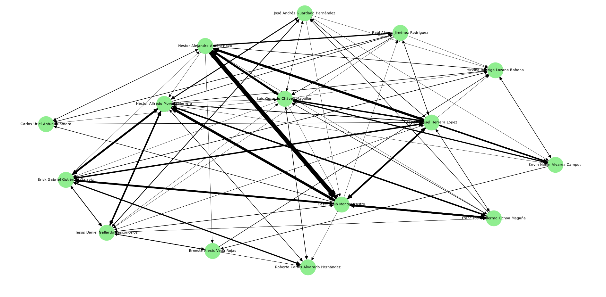
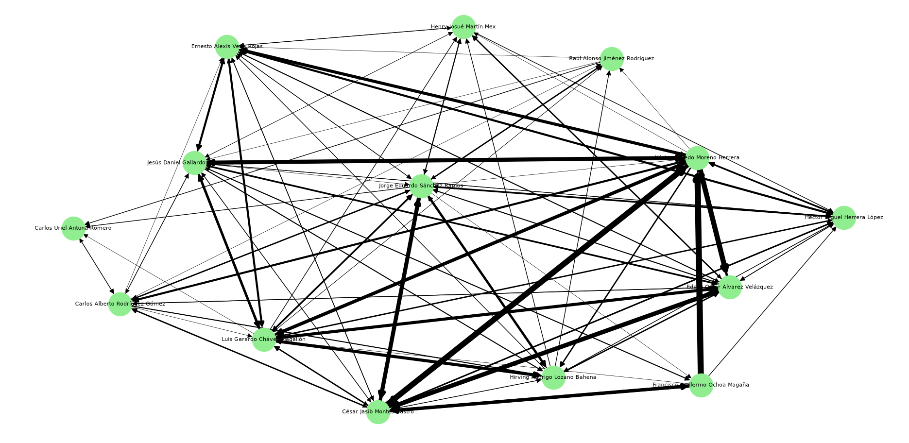

# futbol

interpretacion del partido mexicoo vs argentina analisis 

Nos damos cuenta que cesar montes fue el jugador que tuvo una mayor participacion con una gran cantidad de pases realizados y lo mismo para los recibidos sin embargo alguien que le sigue de cerca es nestor araujo y algo interesante es que nos damos cuenta que quien tuvo mas pases hacia a  araujo fue montes dandonos una idea de quienes eran los protagonistas de este partido. vemos que los jugadores ofensivos tuvieron una participacion meucho menor a comparacion de los defensores dandonos cuenta que se jugaba mas en el area baja en este partido.
en si en el partido de mexico contra argentina vemos que estuvo bastante concentrado el balon en la parte baja ocea la parte defensiva, por conocimiento vemos que los mediocampistas como luis chaves tuvieros muchos pases con los defensores mientras que los que atacan tenian menos participacion en circulacion del balon al realizar pases por lo tanto podemos deducir que mexico tuvo una circulacion del balon bastante centrada a los defensores con algunas jugadas con mediocampistas, el balon casi no llegaba a los jugadores de ataque.
podemos deducir que en este juego la posesion estuvo mas concentrada en una construccion desde atras antes que full ataque por lo cual me parece interesante como aguantaron el balon 

interpretacion del partido mexicoo vs polonia analisis 

nos damos cuenta que hector moreno tuvo una gran participacion en este partido seguido de cesar montes y luis chavez pero en mucho menor proporcion ochoa le realizo muchos pases a moreno haciendo una conexion muy fuerte y solo con esto nos damos cuenta que en este partido mexico tambien estaba jugando mucho en el area baja del campo nuevamente.
Al observar vemos que en el partido de mexico contra polonia el grafo muestra otra vez al igual que contra argentina que la circulacion del balon estaba muy concentrada con los defensas y en el medio campo, moreno tuvo muchas conexiones con jugadores de mediocampo como edson alvares y luis chavez mostrando nuevamente una conducta donde mexiico utilizo principalmenet a sus defensores y mediocampistas para manetener la circulacion del balon y concentrandose en el juego desde la parte de atras, en comparacion con los jugadores de ataque que casi no tocan el balon.
El grafo representa un estilo de juego basado en la contruccion desde la sona de atras hacia el medio campo al iguall que contra argentina
