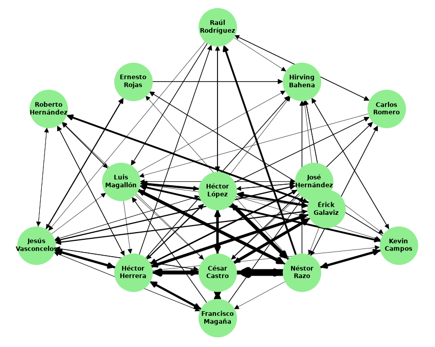
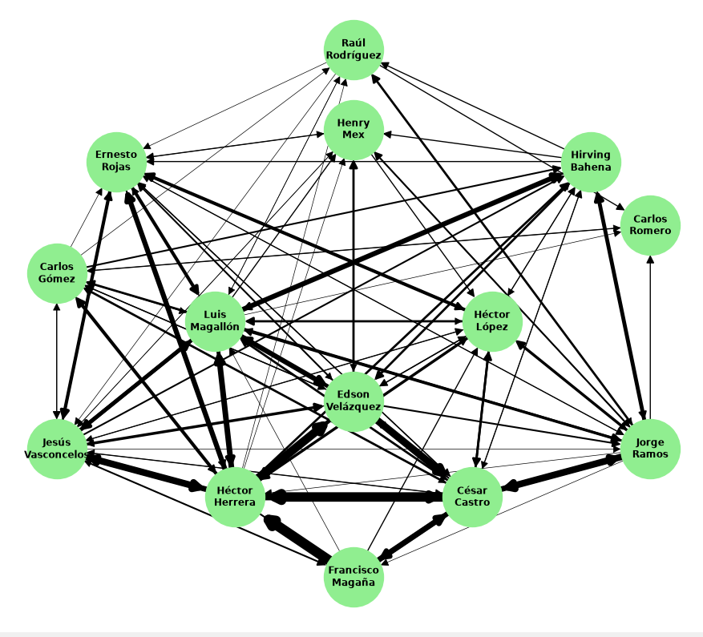
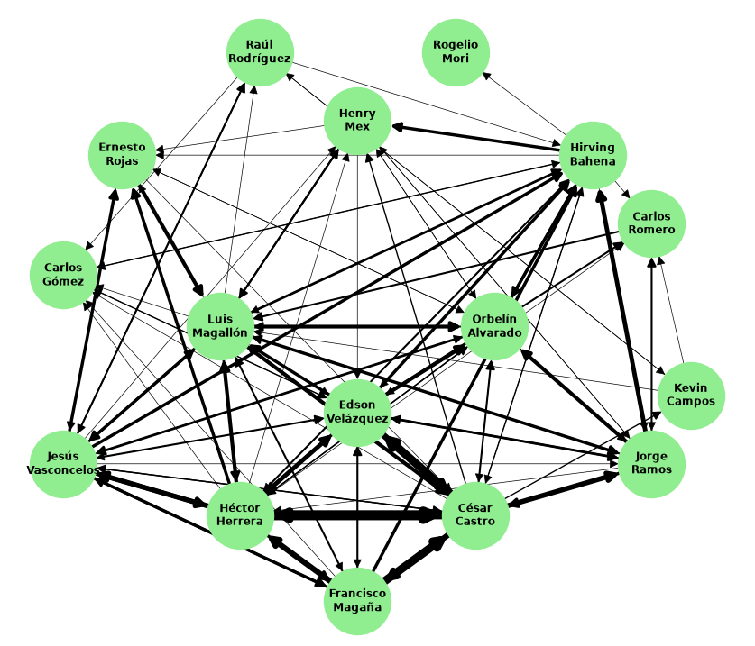

# futbol

## Interpretacion del partido Mexico vs Argentina analisis 

Argentina es un rival  que ejerce una presión asfixiante y domina la posesión de la pelota. Para no perder el balón en zonas de riesgo, México se vio obligado a replegarse, acortar las distancias entre sus líneas y generar apoyos constantes en campo propio. Por lo mismo se vieron obligados a utilizar un 5-3-2, una alineacion totalmente defensiva la cual hizo que el grafo se viera más denso que los demás, a eso se debe la gran concentración de pases entre defensas. 

Ante la imposibilidad de progresar Por medio campo, Mexico utilizó pases horizontales y de seguridad entre defensores para intenar construir sus jugadas, siendo la defensa la base principal para armar jugadas que fueron de ayuda para que el partido no terminara de la peor manera, a pesar del resultado.

Nos damos cuenta que Cesar Montes fue el jugador que tuvo una mayor participacion, con una gran cantidad de pases realizados y lo mismo para los recibidos. Sin embargo, alguien que le sigue de cerca es Nestor Araujo, y algo interesante es que nos damos cuenta que quien tuvo mas pases hacia Araujo fue Montes, dandonos una idea de quienes eran los protagonistas de este partido. 

Vemos que los jugadores ofensivos tuvieron una participacion meucho menor a comparacion de los defensores, dandonos cuenta que se jugaba mas en el area baja en este partido.

En si, en el juego de Mexico contra Argentina estuvo bastante concentrado en defender y hacer contas. Por conocimiento, vemos que los mediocampistas como Luis Chaves tuvieros muchos pases con los defensores, mientras que los que atacan tenian menos participacion en circulacion del balon al realizar pases. Por lo tanto, podemos deducir que Mexico tuvo una circulacion del balon bastante centrada a los defensores, con algunas jugadas con mediocampistas, el balon casi no llegaba a los jugadores de ataque, es por eso que se dio el resultado a favor de la seleccion de Argentina.

## Interpretacion del partido Mexico vs Polonia analisis 

Podemos ver que Hector Moreno tuvo una gran participacion en este partido, seguido de Cesar Montes y Luis Chavez, pero en mucho menor proporcion. Ochoa le realizo muchos pases a Moreno, haciendo una conexion muy fuerte, y solo con esto nos damos cuenta que en este partido Mexico tambien estaba jugando mucho en el area baja del campo nuevamente.

Al observar, vemos que en el partido de Mexico contra Polonia el grafo muestra otra vez, al igual que contra Argentina, que la circulacion del balon estaba muy concentrada con los defensas y en el medio campo. Moreno tuvo muchas conexiones con jugadores de mediocampo como Edson Alvares y Luis Chavez, mostrando nuevamente una conducta donde Mexico utilizo principalmenet a sus defensores y mediocampistas para manetener la circulacion del balon y concentrandose en el juego desde la parte de atras, en comparacion con los jugadores de ataque que casi no tocan el balon.

El grafo representa un estilo de juego basado en la contruccion desde la sona de atras hacia el medio campo, al igual que contra Argentina.

## Interpretacion del partido Mexico vs Arabia analisis 

